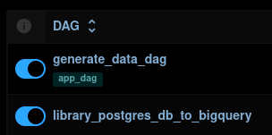

# Capstone Project 3

Repository ini adalah hasil kerja saya untuk tugas Capstone Project ke-3 untuk Kelas Data Engineering Purwadhika. Secara garis besar saya diminta untuk membuat suatu pipeline yang mengutilisasi Airflow sebagai *orchestrator* dua DAG (Directed Acyiclic Graph) yang bertujuan untuk (1) Generasi *dummy data* dan menyimpannya dalam suatu database (PostgreSQL) dan (2) melakukan ingestion data tersebut dari database ke Google BigQuery, suatu cloud-based data warehouse. Graph dibawah dapat dilihat sebagai gambaran umum project ini.


Seperti yang bisa kita lihat di gambar diatas, untuk seluruh local service yang kita bangun (Airflow & PostgreSQL) dijalankan melalui Docker. Docker sangat membantu, karena tools tersebut memudahkan kita untuk melakukan instalasi terhadap service-service tersebut sebagaimana virtual computer namun dilakukan dalam komputer lokal kita. 

## Cara Menggunakan

Untuk menjalankan project ini, kita menggunakan docker. Dalam project ini, kita menggunakan 5 services yaitu 2 PostgreSQL database yaitu `application_db` dan `airflow_db`. `application_db` untuk menyimpan secara lokal geneasi data kita dan `airflow_db` untuk menyimpan metadata Airflow. Lalu services Airflow yaitu, `init_airflow` untuk meng*intialize* airflow, `webserver` yang menghost webUI airflow untuk kita berinteraksi dengan airflow, dan `scheduler` yang menjalankan orkestrasi yang telah didesain.

Satu hal yang diperhatikan adalah penggunaan docker network. Docker network dibentuk dalam file docker-compose bersama `airflow_db` Dengan menggunakan network, hal tersebut memudahkan komunikasi antar container dimana kita menggunakan nama service kita sebagai *host* dan menggunakan container port yang kita tuliskan didalam file `docker-compose.yaml` kita. Hal ini juga meningkatkan security, membantu kita untuk mengawasi dan mengatur external access dengan lebih mudah.

Namun, karena docker network tersebut dibuat dalam file docker compose `prod_airflow_db` maka kita harus menjalankan docker compose tersebut terlebih dahulu agar network dipersiapkan sebelum digunakan container lain. Hal itu dapat dilakukan dengan command dibawah.

```
docker compose -f prod_airflow_db/docker-compose.yaml up -d
docker compose -f prod_airflow_service/docker-compose.yaml up -d
docker compose -f app_db/docker-compose.yaml up -d
```

atau bisa saja ke kita ke directory masing-masing dan menjelankannya secara tersendiri dengan `docker compose up -d`. Namun tetap diperhatikan, kita jalankan yang berada di directory `prod_airflow_db` terlebih dahulu.

Setelah itu kita bisa membuka webserver airflow di browser dengan membuka `localhost:8080/`. Di dalam web UI tersebut, karena project kita didesain untuk dijalankan setiap satu jam, kita hanya perlu mengeser tombol yang berada disebelah DAG kita.



jika ingin memberhentikan service kita berikan command:

```
docker compose -f prod_airflow_service/docker-compose.yaml down
docker compose -f app_db/docker-compose.yaml down
docker compose -f prod_airflow_db/docker-compose.yaml down
```

## DAGs (Directed Acyclic Graphs)

### (1) Create data and insert to PostgreSQL

Dalam DAG pertama kita, kita diminta untuk generate database dengan schema seperti:


Cara untuk menggenerate data tersebut adalah dengan menggunakan API random name generator untuk nama member dan OpenLibrary untuk Judul Buku.

Masing-masing tabel memiliki *primary key* masing-masing yang menjadi *foreign key* didalam table *rent_table*. *primary key* juga berurutan, memudahkan kita untuk menggunakan *primary key* terakhir untuk menggenerasi *primary key* selanjutnya.


Dari gambar diatas, kita dapat melihat bahwa sebelum kita generate data kita akan mengambil id list dari masing-masing tabel di PostgreSQL (akan menjadi 0 pada generate pertama), hal ini dilakukan untu memastikan tidak ada id yang sama pada generate data dengan data sebelumnya.

Lalu setelah itu kita menjalankan secara bersamaan generate data pada tabel `books_table` dan `library_member`. Hal ini dilakukan terlebih dahulu karena untuk generate data pada `rent_data` kita akan mengambil id dari dua tabel sebelumnya dan dipilih secara random.

setelah semua data di generate, kita akan masing-masing insert datanya kedalam PostgreSQL dengan menggunakan *library* psycopg2 melalui helper file `postgres_app_helper`.

### (2) PostgreSQL to BigQuery

Dalam DAG ini, kita diminta untuk melakukan ingestion dari data yang telah kita generate sebelumnya dan kita simpan di database PostgreSQL ke Google BigQuery.


Proses dari DAG ini didahulukan dengan menggunakan task `check_dataset` yang akan mememeriksa apakah dataset sudah tersedia pada BigQuery target. Tergantung hasil return dari *check_dataset*, jika `True` maka `create_dataset` task akan menjalankan pembuatan dataset. Bila hasil return `False` , maka task `create_dataset` akan di skip sebagaimana graph diatas.

Karena task sebelumnya di skip, kita harus memastikan `trigger_rule` untuk task selanjutnya. Karena secara *default* `trigger_rule` yang digunakan adalah `all_success`, yang memastikan bahwa task sebelumnya harus berhasil berjalan, kita akan mengubah value `trigger_rule` dalam task selanjutanya menjadi `none_failed`.

Dalam membuat DAG ini, kita menggunakan yaml file sebagai configuration file untuk menyimpan detail informasi tabel kita. Penggunaan file yaml membantu karena ini dapat digunakan untuk *dynamic dag*, menggunakan 1 task group sebagai template untuk beberapa table.

Seperti yang kita lihat diatas setiap table diproses dengan template task yang sama. (1) kita melakukan ingestion dari PostgreSQL dengan library pandas dan menyimpannya sebagai csv dalam temporary storage kita, (2) kita melakukan load staging table dengan menggunakan Google Cloud Python API secara incremental, dan (3) kita melakukan upsert ke final table kita secara incremental.

Penggunaan staging table dengan final/production table membantu untuk memastikan bahwa final table sudah siap digunakan dan segala pemrosesan yang belum selesai dilakukan di staging table.