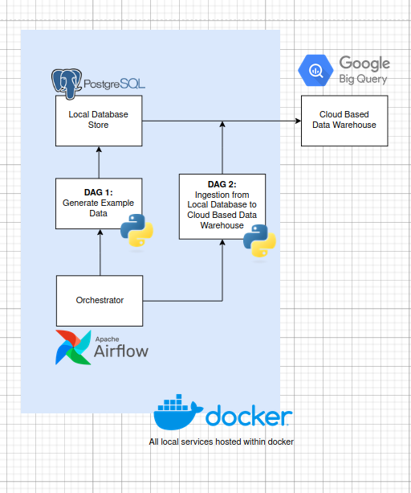
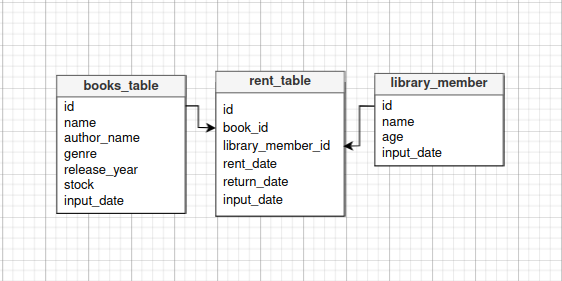
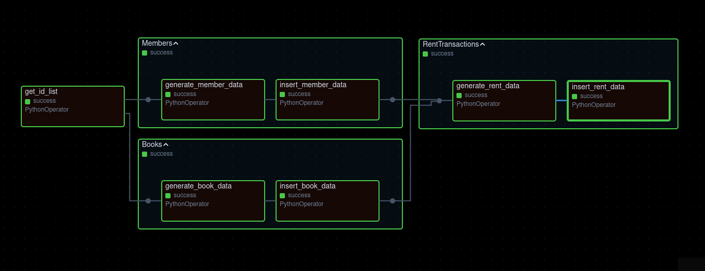
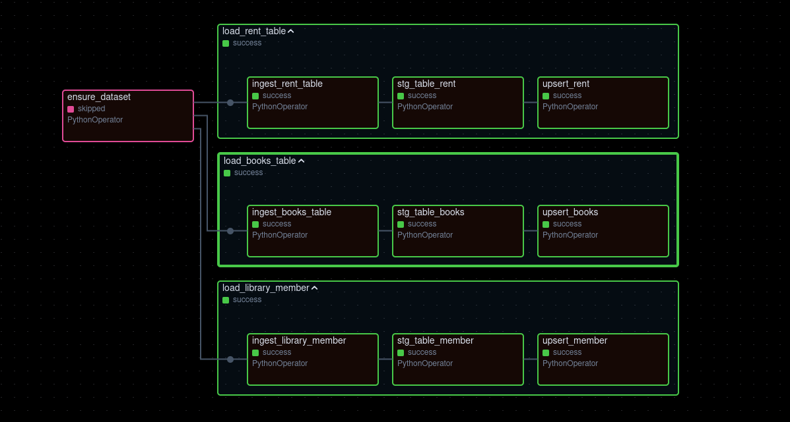

# Capstone Project 3

Repositori ini adalah hasil kerja saya untuk tugas Capstone Project ke-3 untuk Kelas Data Engineering Purwadhika. Secara garis besar saya diminta untuk membuat suatu pipeline yang mengutilisasi Airflow sebagai *orchestrator* dua DAG (Directed Acyiclic Graph) yang bertujuan untuk (1) Generasi *dummy data* dan menyimpannya dalam suatu database (PostgreSQL) dan (2) melakukan ingestion data tersebut dari database ke Google BigQuery, suatu cloud-based data warehouse. Graph dibawah dapat dilihat sebagai gambaran umum project ini.



Seperti yang bisa kita lihat di gambar diatas, untuk seluruh local service yang kita bangun (Airflow & PostgreSQL) dijalankan melalui Docker. Docker sangat membantu, karena tools tersebut memudahkan kita untuk melakukan instalasi terhadap service-service tersebut sebagaimana virtual computer namun dilakukan dalam komputer lokal kita. 

## Cara Menggunakan

Sebelum menjalankan program ini, Kita harus memastikan bahwa network yang digunakan antar container untuk berkomunikasi dengan satu sama lain sudah berjalan. Untuk itu kita bisa meng-check terlebih dahulu dan menjalankan perintah dibawah dalam terminal.

```
$ docker network ls
```

lalu jika memang network yang digunakan belum berjalan kita bisa menjalankannya dengan (dalam project ini menggunakan network `application-network`)

```
$ docker network create application-network
```

Dengan menggunakan network, ini dapat memudahkan komunikasi antar container dimana kita menggunakan nama service kita sebagai *host* dan menggunakan container port yang kita tuliskan didalam file `docker-compose.yaml` kita. Hal ini juga meningkatkan security, membantu kita untuk mengawasi dan mengatur external access dengan lebih mudah.

Lalu setelah memastikan network kita sudah berjalan, menjalankan docker container kita dalam ketiga directory container kita yaitu `app_db`, `prod_airflow_db,` dan `prod_airflow_service`. Jangan lupa juga untuk mematikan proccess dalam port `5432` karena container PostgreSQL kita menggunakan port tersebut sebagai `host_port`.

```
$ docker compose up -d
```

Setelah itu kita bisa membuka webserver airflow di browser dengan membuka `localhost:8080/`. Di dalam web UI tersebut, karena project kita didesain untuk dijalankan setiap satu jam, kita hanya perlu mengeser tombol yang berada disebelah DAG kita.

## DAGs (Directed Acyclic Graphs)

### (1) Create data and insert to PostgreSQL

Dalam DAG pertama kita, kita diminta untuk generate database dengan schema seperti:



Cara untuk menggenerate data tersebut adalah dengan menggunakan API random name generator untuk nama member dan OpenLibrary untuk Judul Buku.

Masing-masing tabel memiliki *primary key* masing-masing yang menjadi *foreign key* didalam table *rent_table*. *primary key* juga berurutan, memudahkan kita untuk menggunakan *primary key* terakhir untuk menggenerasi *primary key* selanjutnya.



Dari gambar diatas, kita dapat melihat bahwa sebelum kita generate data kita akan mengambil id list dari masing-masing tabel di PostgreSQL (akan menjadi 0 pada generate pertama), hal ini dilakukan untu memastikan tidak ada id yang sama pada generate data dengan data sebelumnya.

Lalu setelah itu kita menjalankan secara bersamaan generate data pada tabel `books_table` dan `library_member`. Hal ini dilakukan terlebih dahulu karena untuk generate data pada `rent_data` kita akan mengambil id dari dua tabel sebelumnya dan dipilih secara random.

setelah semua data di generate, kita akan masing-masing insert datanya kedalam PostgreSQL dengan menggunakan *library* psycopg2 melalui helper file `postgres_app_helper`.

### (2) PostgreSQL to BigQuery



*to be added soon...*
